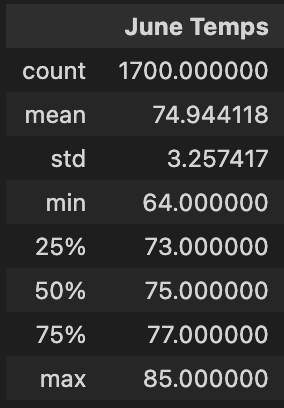
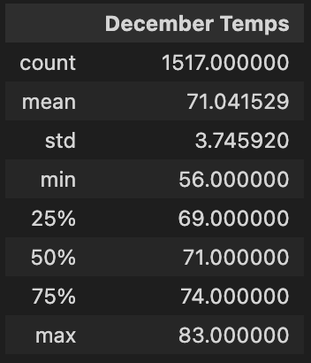

# surfs_up

## Overview
This is a analysis of weather data across Oahu - a potential Hawaii Island to invest and setup a Surf & Ice-cream shop. The weather data will be stored in SQLite Database file and will be presented using Flask. Weather data was collected across the Oahu island with the help of 9 Weather stations, for a time span of around 6 to 7 yrs of weather data was stored in the sqlite DB from the year 2010 to 2017.

## **Summary**

Comparing June and December statistics:
- June has better temperatures ranging between 64 to 85, which is ideal for surfing and icecream. Whereas, December temperatures ranges around 56 to 83 degrees. 
- Same trend is seen in the mean temperature readings. June has a mean temp of 75 degrees but December has a mean temperature of around 71.
- The percentile stats also reveals the same trends of proportionate dropping of temperatures in December when compared to % values of June. 

</img>

</img>
